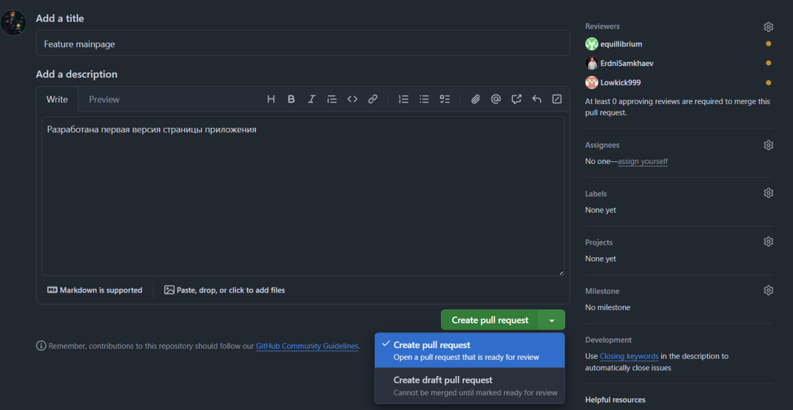

# Задания ЛП3

1.	Создание Pull Request для завершенных задач.

2.	Описание PR: что было сделано, скриншоты (если уместно).

3.	Код-ревью: как минимум один другой участник команды должен проверить код и апрувить PR.

4.	Мерж PR в ветку main/master после апрува.

5.	Обновление доски: перемещение задачи в Done.

# Отчет о выполнении ЛП3
Активность: https://github.com/equillibrium/synergy406todo/commits/lp3

1. Создал Pull Request FEATURE-mainpage ветки с main.
2. Добавлено описание PR - https://github.com/equillibrium/synergy406todo/pull/69
3. Код-ревью проведен тестировщшиком в таске https://github.com/equillibrium/synergy406todo/issues/31
4. Мердж выполнен
5. Прогресс отражен на доске
    

